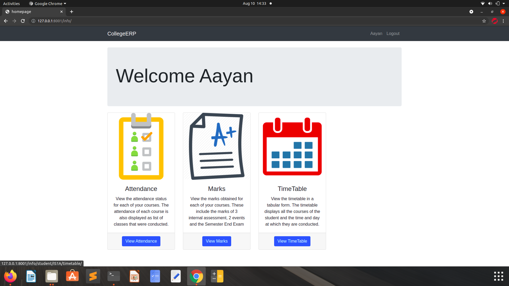
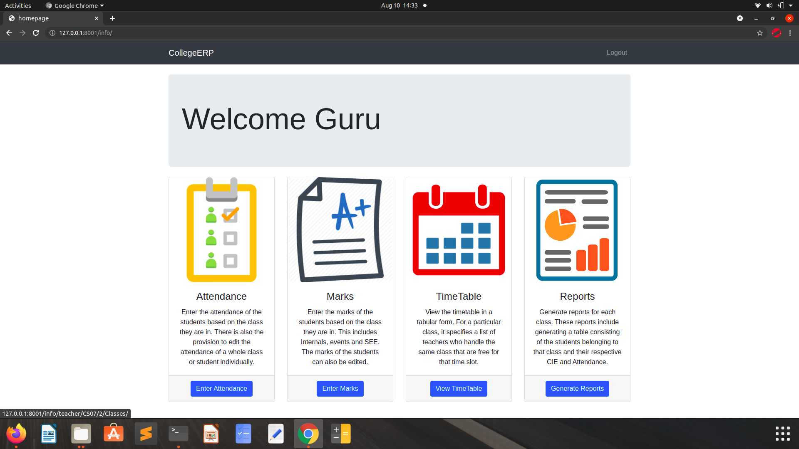
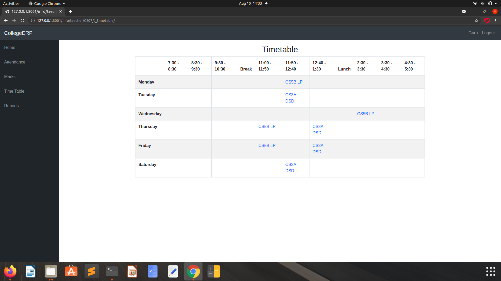

# College-AMTR

A college management system built using Django framework. It is designed for interactions between students and teachers. Features include attendance, marks and time table.

In LOGIN , The username for all is different but password for everyone is 'project123'.

Example usernames:
student- 'aayan'
teacher- 'guru'
## Installation

Install my-project as zip or clone.

```bash
    git clone https://github.com/Yesh123456/College-AMTR.git
```

Install Django.(For Ubuntu)

```bash
     pip install django
```
Create VirtualEnv.

```bash
    virtualenv myenv
    cd
    source bin/activate
```

Run requirements.txt file.

```bash
    sudo install -r requirements.txt
```

Run your project:

```bash
    python manage.py runserver
```

If you want to change data from database, then create django superuser.

```bash
    python manage.py createsuperuser
    pytthon manage.py runserver
```

Now when you are running your project on https://localhost:8000/admin

LOGIN with newly created essentials.

## Features

- ColorFull scheme
- Live previews
- Responsive app
- Web Application

  
## Screenshots








## Feedback

If you have any feedback, please reach out to us at isco30427@gmail.com

  
## Badges

Add badges from somewhere like: [shields.io](https://shields.io/)

[](https://github.com/tterb/atomic-design-ui/blob/master/LICENSEs)
[](https://opensource.org/licenses/)
[](http://www.gnu.org/licenses/agpl-3.0)

  
